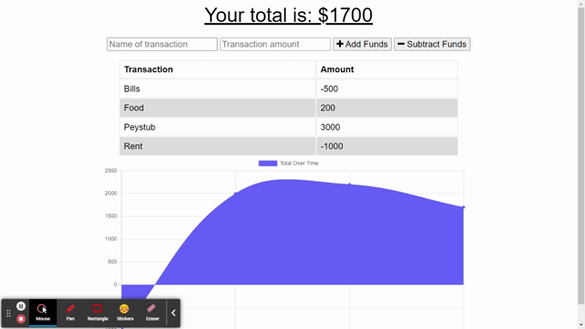

# PWA_BT

Progressive Web Application/Budget Tracker.

## UserStory

AS AN avid traveler  
I WANT to be able to track my withdrawals and deposits with or without a data/internet connection  
SO THAT my account balance is accurate when I am traveling

## AcceptanceCriteria

GIVEN a budget tracker without an internet connection  
WHEN the user inputs an expense or deposit  
THEN they will receive a notification that they have added an expense or deposit  
WHEN the user reestablishes an internet connection  
THEN the deposits or expenses added while they were offline are added to their transaction history and their totals are updated

## Screenshot



## Live Deployment
[View the Live app with Heroku.](https://evening-lake-38762.herokuapp.com/)

## Installation

Requires the following packages

* [express](https://www.npmjs.com/package/express)
* [mongoose](https://www.npmjs.com/package/mongoose)
* [compression](https://www.npmjs.com/package/compression)
* [morgan](https://www.npmjs.com/package/morgan)

```
npm install
```

## Usage

```
npm start
```
Then open [localhost:3002](http://localhost:3002/) to see the local webpage.

Budget Tracker was created by [Alik Margaryan](https://github.com/AM0726Github)
